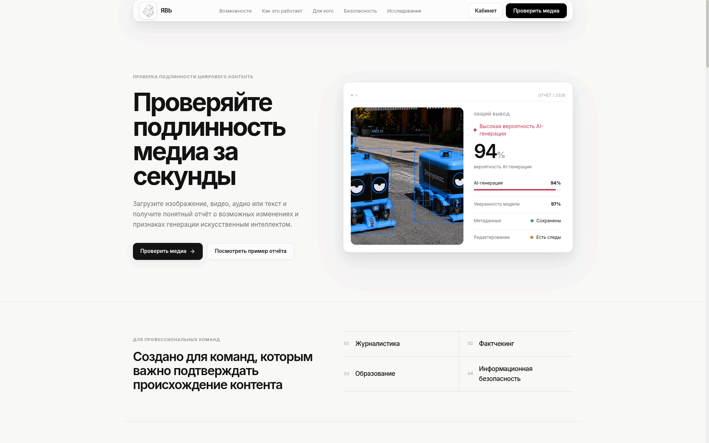
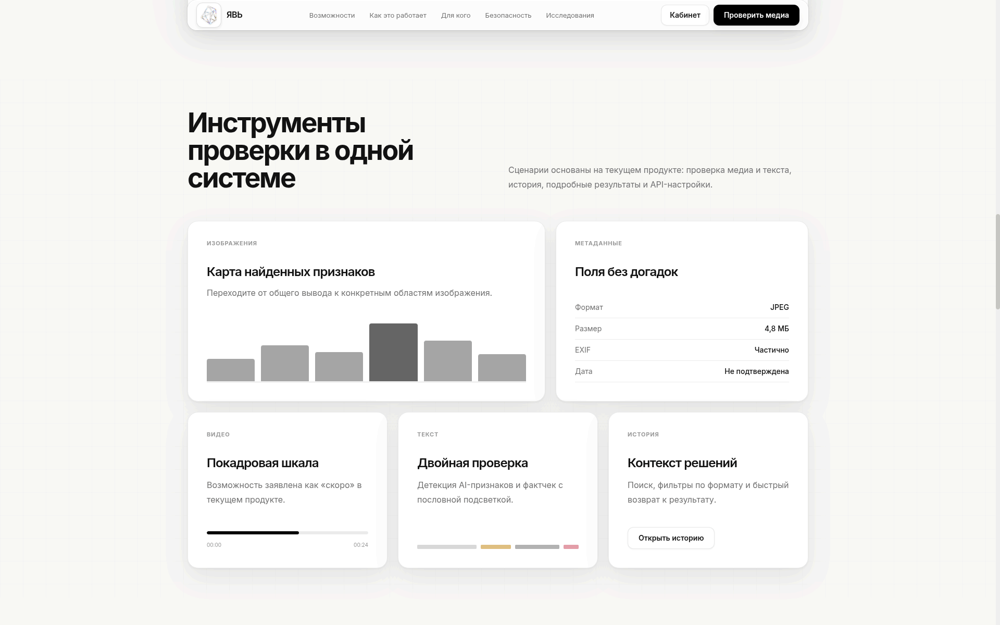
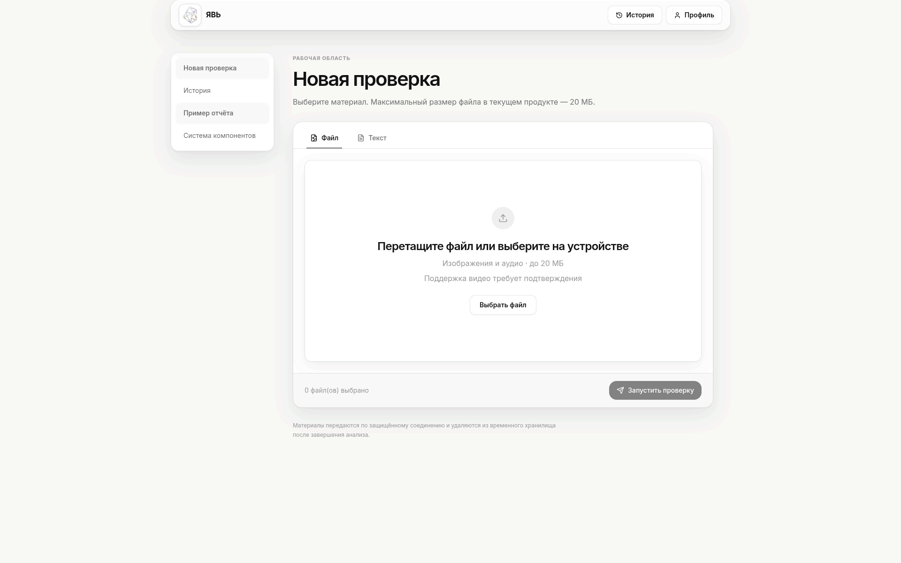
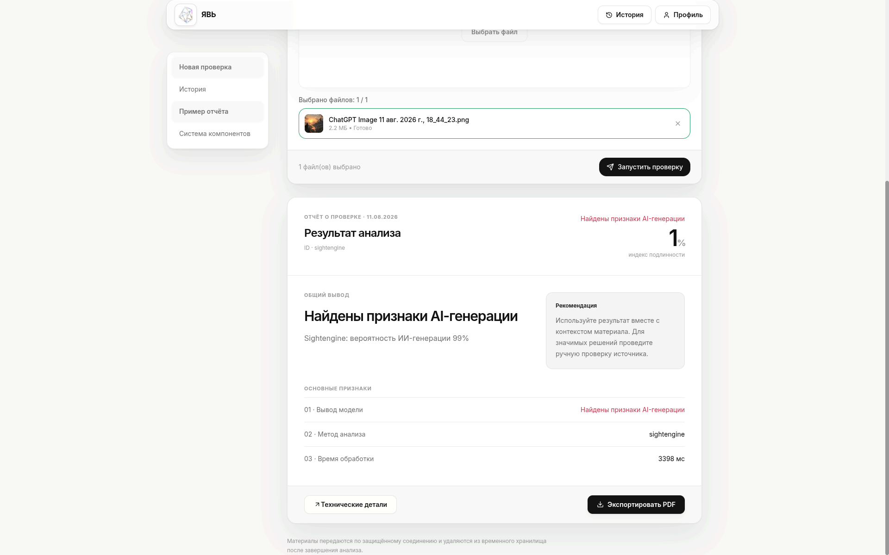
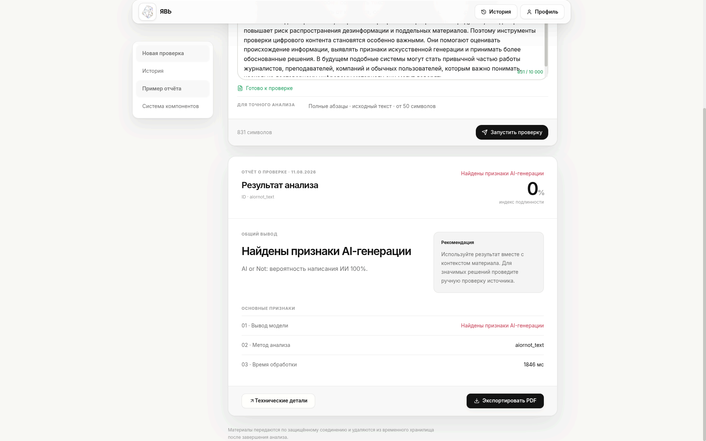
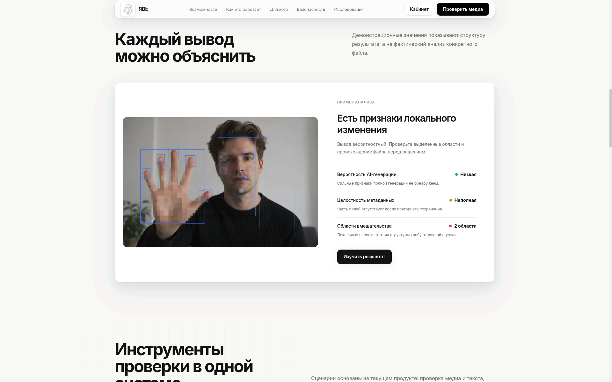
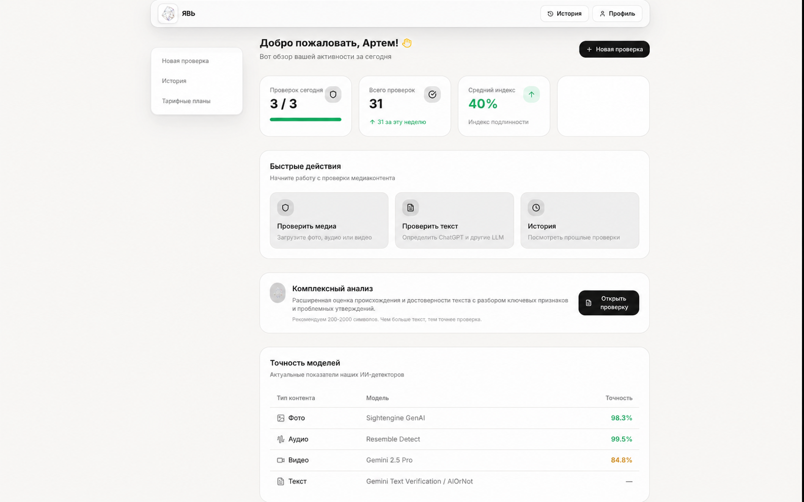
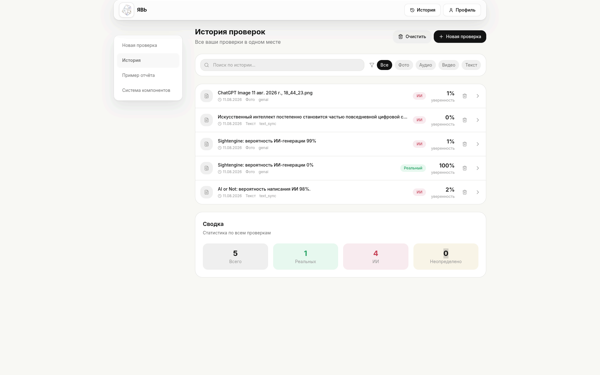
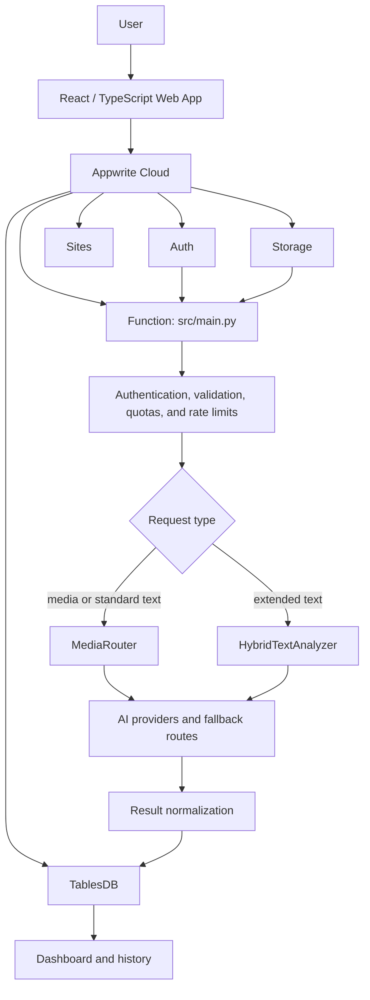

<div align="center">
  <p>
    <a href="./README.md">🇷🇺 Русский</a> ·
    <a href="./README.en.md"><strong>🇬🇧 English</strong></a>
  </p>

  

  <h1>YAV</h1>

  <p><strong>AI-generated content detection for text and media</strong></p>

  <p>
    YAV works with text, images, audio, and video.<br>
    Each format has its own analysis pipeline,<br>
    and the results are normalized to a common format.
  </p>

  <p>
    
    
    
    
    
  </p>

  <p><a href="https://yav.appwrite.network"><strong>Open YAV</strong></a></p>
</div>



## Contents

- [About](#about)
- [Features](#features)
- [How YAV works](#how-yav-works)
- [Interface](#interface)
- [Architecture](#architecture)
- [Models and providers](#models-and-providers)
- [Tech stack](#tech-stack)
- [Security](#security)
- [Running locally and testing](#running-locally-and-testing)
- [What's next](#whats-next)
- [Team](#team)
- [License](#license)

## About

Images, text, and audio require different detectors, so we don't run everything through the same model. The backend identifies the content type, selects the right pipeline, and returns a clear result.

YAV can be used to check publications, academic work, and material from public sources.

## Features

| Area | What's available |
| --- | --- |
| Text | Checks text for signs of AI generation. |
| Images | Checks images, with a fallback model if the primary provider is unavailable. |
| Audio | Detects synthesized speech through a separate analysis pipeline. |
| Video | Sends the file to Gemini Video Verification for analysis. |
| Extended text analysis | AI detection, fact-checking, source links, and highlighting of matching passages. |
| History and account | Statistics, search, filters, and management of previous checks. |
| Report | Verdict, authenticity index, explanation, provider, model, and processing time; reports can be saved as PDF through the browser's print dialog. |



*The main workflows are available in a single web app.*

## How YAV works

1. The user enters text or uploads one supported file with a maximum size of 20 MB.
2. The backend checks the user, usage limits, and the content itself.
3. `MediaRouter` selects an analyzer based on the content type. Extended text analysis uses `HybridTextAnalyzer`.
4. Responses from different models are normalized to a common format.
5. The result is stored in Appwrite TablesDB and appears in the history.

The result includes several fields: `verdict` (`REAL`, `FAKE`, or `UNCERTAIN`), AI-generation probability in `ai_probability`, the authenticity index in `authenticity_index`, the provider and model, and processing time in `processing_ms`.

<table>
  <tr>
    <td width="33%"></td>
    <td width="33%"></td>
    <td width="33%"></td>
  </tr>
  <tr>
    <td align="center">Upload a file or enter text</td>
    <td align="center">Image result</td>
    <td align="center">Text result</td>
  </tr>
</table>



The verdict comes with a short explanation and a recommendation to check the context. The model evaluates signs of AI generation but does not prove the origin of a file or text.

## Interface

The dashboard shows checks for the current day and week, the total number of checks, and the average index. You can search the history, filter it by content type, and clear all records or remove them one at a time.

<table>
  <tr>
    <td width="50%"></td>
    <td width="50%"></td>
  </tr>
  <tr>
    <td align="center">Activity overview</td>
    <td align="center">Search, filters, and previous checks</td>
  </tr>
</table>

*The screenshots use demo values. The current pipelines are listed below.*

## Architecture



The frontend is hosted on Appwrite Sites. Auth manages sessions and email verification, Storage accepts files, Function runs the analysis, and TablesDB stores profiles, counters, and results. The code in `api/` is used separately and is not the primary backend for the web app.

## Models and providers

| Content type | Provider | Model / API mode | Role |
| --- | --- | --- | --- |
| Text | AI or Not | `text_sync` | Primary option for text that meets the API constraints |
| Text | Sapling | `aidetect` | Primary option for other text; fallback when AI or Not is unavailable |
| Fact-checking | g4f | `gpt-4.1-nano` | First option in the extended analysis cascade |
| Fact-checking | g4f | `gpt-oss-120b` | First fallback |
| Fact-checking | g4f | `command-r` | Second fallback |
| Images | Sightengine | `genai` | Primary analyzer |
| Images | Hugging Face | `dima806/deepfake-vs-real-image-detection` | Fallback analyzer |
| Audio | Resemble Detect | `detect_v1` | Primary analyzer |
| Audio | Hugging Face | `mo-gg/wav2vec2-large-xlsr-deepfake-detection` | Fallback analyzer |
| Video | Gemini | `GEMINI_MODEL` | Primary analyzer |

The table lists the model identifiers and API modes currently used in the code.

## Tech stack

| Project area | Main technologies |
| --- | --- |
| Web | React 18.3, TypeScript 5.6, Vite 5, Tailwind CSS 3, React Router 6, Zustand 5, React Dropzone, Lucide React, Appwrite Web SDK |
| Primary backend | Python 3.14 in Appwrite Functions, Pydantic 2, HTTPX, Pillow, PyJWT, email-validator |
| Cloud | Appwrite Auth, TablesDB, Storage, Functions, and Sites |
| Quality checks | Pytest, pytest-asyncio, Vitest, TypeScript compiler, Ruff |
| Additional apps | FastAPI/Uvicorn API layer, Telegram Bot built with aiogram, and Telegram Mini App |

The shared Python code supports Python 3.11 and later. The Appwrite Function runs on Python 3.14.

Main directories:

```text
YAV/
├── web/          # React app and Appwrite Site configuration
├── src/          # Appwrite Function, validation, persistence, and limits
├── adapters/     # AI provider integrations
├── router/       # Content-type routing
├── core/         # Configuration, contracts, and normalization
├── api/          # Additional FastAPI layer
├── bot/          # Telegram Bot
├── miniapp/      # Telegram Mini App
├── tests/        # Unit, integration, and e2e tests
└── doc/screen/   # Interface screenshots
```

## Security

- Appwrite provides the user identity. A `userId` from the request body is not used for authorization.
- The backend checks email verification before running an analysis.
- Results are written by the server. Row Security and owner ACL keep each user's history separate.
- Files are limited to 20 MB; the backend validates their type and signature. Images are also decoded with Pillow and checked for size.
- Audio gets an additional ffprobe check. Video does not depend on FFmpeg or ffprobe: after size, signature, and type validation, the server uploads it to a temporary Gemini File API resource for Gemini Video Verification.
- Quotas and rate limits apply to users, IP addresses, and external providers. Where supported, a fallback takes over if the primary analyzer fails.
- Users receive a safe error message. Secrets, source material, and full provider responses are not included in client errors or logs.

## Running locally and testing

You need Git, Python 3.11+, and Node.js with npm.

```bash
git clone https://github.com/dany-simonov/YAV.git
cd YAV

python -m venv .venv
source .venv/bin/activate
python -m pip install --upgrade pip
python -m pip install -e ".[dev]"

cd web
npm ci
cp .env.example .env.local
npm run dev
```

Vite starts the frontend at `http://localhost:3001`. The Appwrite Function entry point is `src/main.py`; its Appwrite resources must be configured before it can run an analysis.

Public frontend configuration is documented in [`web/.env.example`](./web/.env.example). Provider secrets are stored in the Appwrite Function settings or a local `.env` file and are not committed to Git.

Synchronous analysis also requires the server-side `SYNCHRONOUS_ANALYZE_EXECUTION_TIMEOUT_SECONDS`, `SYNCHRONOUS_ANALYZE_SAFETY_MARGIN_SECONDS`, and `SYNCHRONOUS_ANALYZE_RESPONSE_SAFETY_MARGIN_SECONDS` settings. The first must match the Function's real timeout; the second reserves time for persistence and the third for response construction. Analysis fails closed until all three are configured. VIDEO requires `GEMINI_API_KEY`, an HTTPS `GEMINI_API_URL`, and `GEMINI_MODEL`; only the backend uploads the already validated Appwrite file. Gemini smoke is disabled by default. Internal diagnostics require `GEMINI_SMOKE_ENABLED=true`, a separate `GEMINI_SMOKE_DIAGNOSTIC_SECRET`, and the `X-YAV-Diagnostic-Authorization` header; an ordinary user cannot invoke it merely by knowing the action name.

Frontend checks:

```bash
cd web
npm test
npm run build
```

Python unit tests and static checks:

```bash
pytest -q tests/unit
ruff check .
python -m compileall -q src adapters core router api
```

Tests in `tests/integration/` call real providers and require a configured environment.

## What's next

- End-to-end analysis of materials and sources;
- More models and fallback providers;
- Expanded audio and video analysis;
- Better history and statistics;
- Integration of the Telegram Bot and Mini App with the main service.

## Team

| Member | Role |
| --- | --- |
| Даниил Симонов | Team Lead · Full-stack / Universal |
| Артём Васильев | Backend · DevOps |
| Иван Новожилов | Frontend |

## License

This project is licensed under the [Apache License 2.0](./LICENSE).

---

<div align="center">
  <p><a href="https://yav.appwrite.network"><strong>Open YAV</strong></a></p>
</div>
