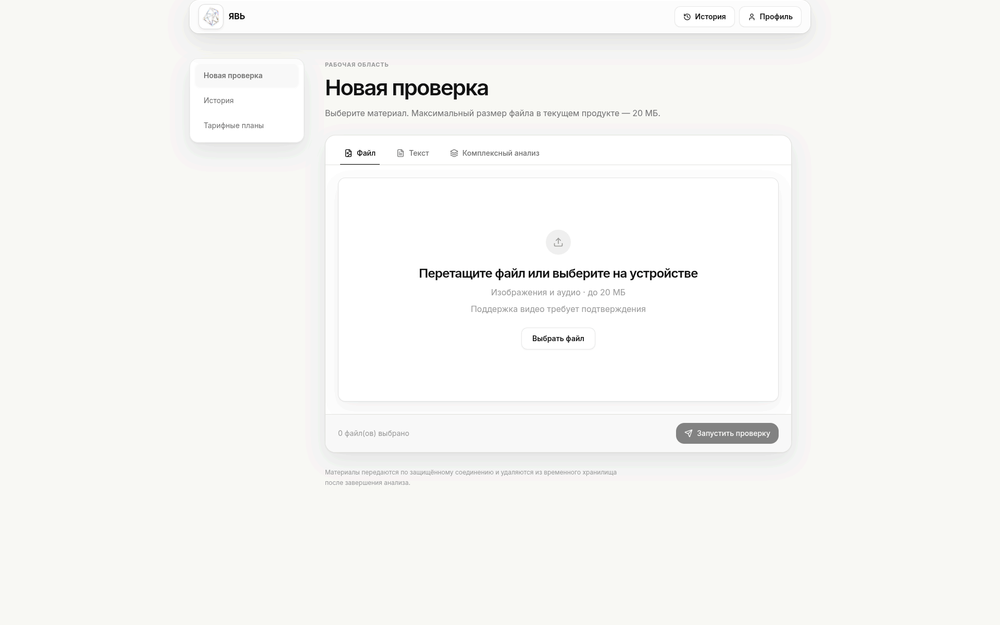
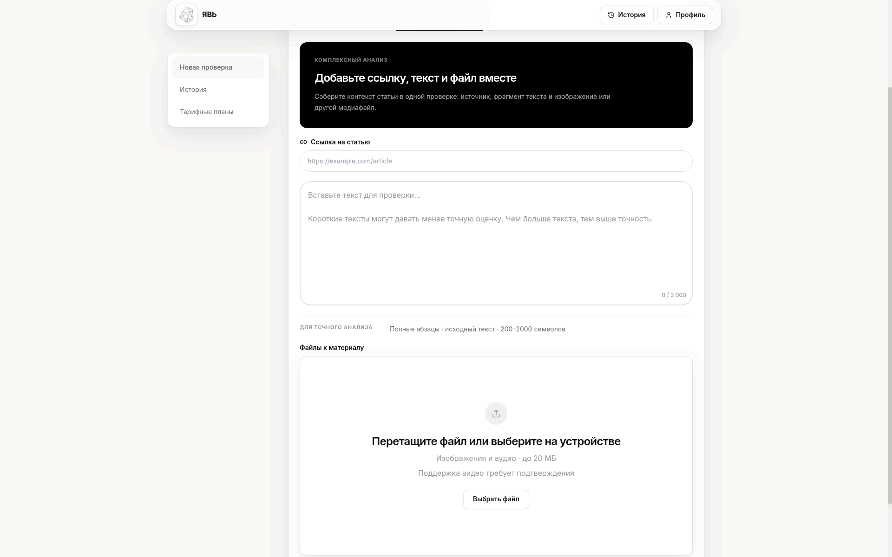
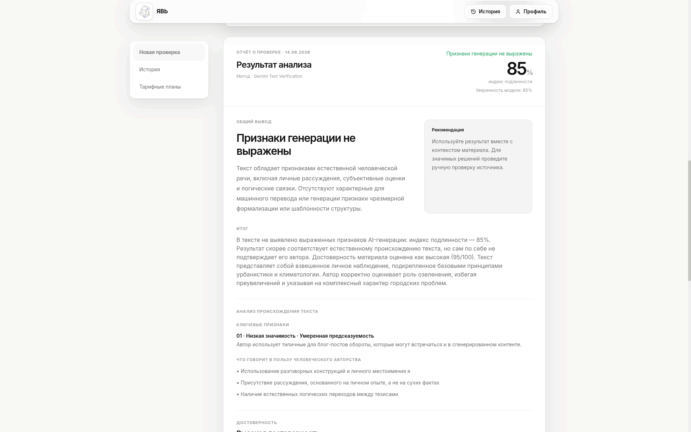
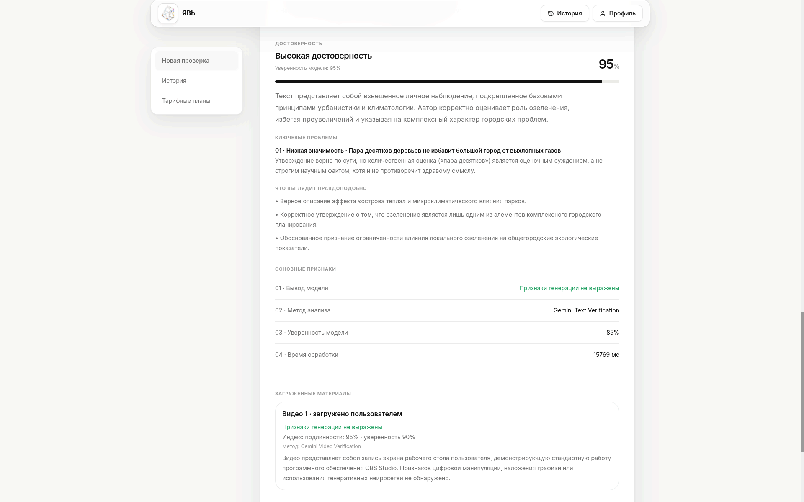
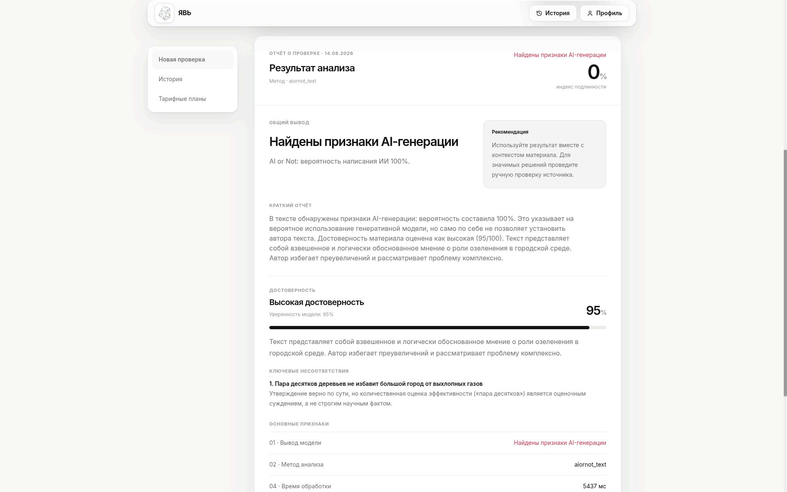
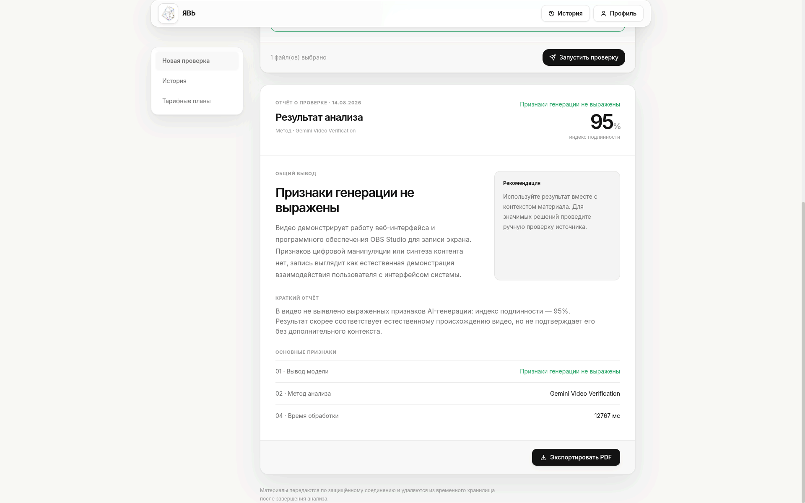
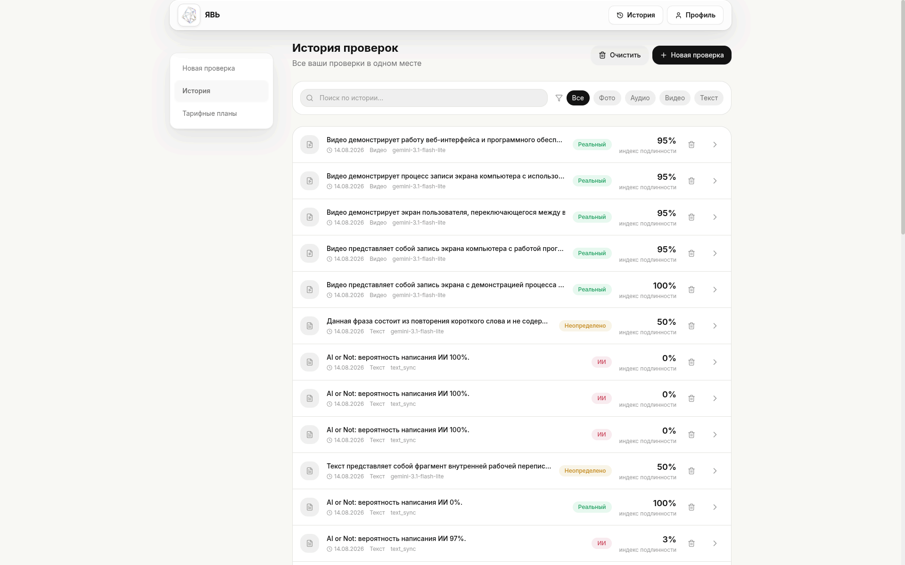
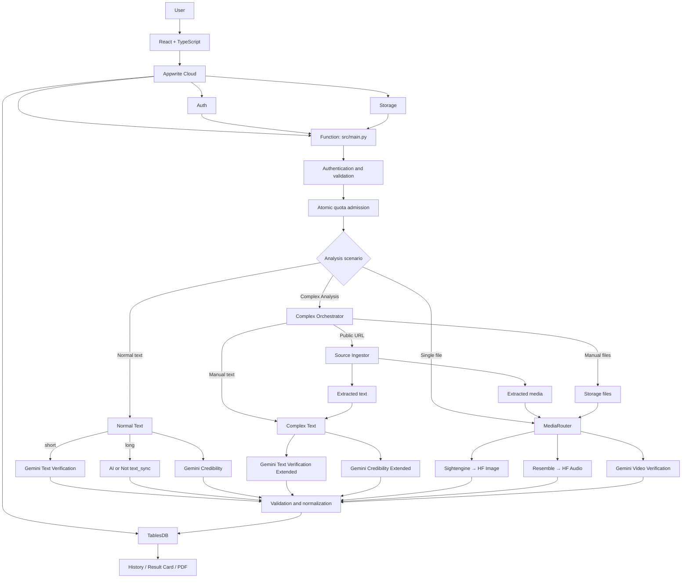

<div align="center">
  <p>
    <a href="./README.md">🇷🇺 Русский</a> ·
    <a href="./README.en.md">🇬🇧 English</a>
  </p>

  

  <h1>ЯВЬ</h1>

  <p><strong>Digital content origin and credibility analysis</strong></p>

  <p>
    Text, images, audio, video, and public pages by URL—<br>
    analyzed in one secure workspace with a clear report.
  </p>

  <p>
    
    
    
    
    
  </p>

  <p><a href="https://yav.appwrite.network"><strong>Open ЯВЬ</strong></a></p>
</div>


## Contents

- [About](#about)
- [What ЯВЬ Can Do](#what-явь-can-do)
- [Complex Analysis](#complex-analysis)
- [How Analysis Works](#how-analysis-works)
- [Interface and Results](#interface-and-results)
- [Architecture](#architecture)
- [Active Models and Providers](#active-models-and-providers)
- [Security and Resilience](#security-and-resilience)
- [Limitations](#limitations)
- [Repository Structure](#repository-structure)
- [Local Setup](#local-setup)
- [Configuration](#configuration)
- [Testing](#testing)
- [Roadmap](#roadmap)
- [Team](#team)
- [License](#license)

## About

**ЯВЬ** is a web service for the initial assessment of digital materials for signs of AI generation and for evaluating text credibility. It does not send every format through a single universal model: each material type is identified and processed by its own pipeline, while provider responses are normalized into a consistent user report.

The project is designed for journalists, verification teams, educators, researchers, and anyone who needs a quick initial assessment before manual review or publication.

ЯВЬ provides probabilistic assessments—not legal or scientific proof of origin, authorship, or truth. A high authenticity index does not mean that a claim is true, and signs of AI generation do not mean that content is false. Results should be interpreted alongside context, the original source, and independent verification.

## What ЯВЬ Can Do

| Scenario | Current implementation |
| --- | --- |
| Normal text | Parallel analysis of AI-origin signals and a separate credibility assessment. |
| Image | AI-generation detection through a primary service with a fallback Hugging Face analyzer. |
| Audio | Synthetic-speech detection; a fallback model is used for supported failures or uncertain results. |
| Video | Analysis of a validated file through Gemini Files API and `generateContent`. |
| Complex Analysis | One analysis for a public URL, text, and up to four files in any supported combination. |
| History | Stored results, search, filtering by type, detailed views, and record deletion. |
| Dashboard | Activity summary, daily usage, number of analyses, and average authenticity index. |
| Research | Public digital-content case studies and reproducible benchmark materials in the repository. |
| Report | Verdict, authenticity index, explanation, model, duration, credibility section, and available results for individual materials. |

Supported files:

- images: JPEG, PNG, WebP;
- audio: MP3, WAV, OGG, M4A;
- video: MP4, AVI, MOV;
- maximum size per file in the main interface: 20 MiB.



## Complex Analysis

Complex Analysis brings the context of a publication into a single request. A user can provide:

- a public HTTP/HTTPS URL;
- text of at least 200 characters;
- up to four image, audio, or video files;
- any combination of these inputs, as long as at least one is present.

All seven combinations are supported: URL; text; files; URL + text; URL + files; text + files; URL + text + files.



For a URL, the backend safely fetches an accessible HTML page, extracts a bounded text fragment plus available image and direct video candidates, and routes each material type to its corresponding analysis pipeline. Manually entered text retains separate provenance. Manual files are read from Appwrite Storage using the user's JWT and owner ACL, then pass through the standard secure validation path. Independent branches can produce a partial result: an unavailable media source does not replace or invalidate analysis already returned by another branch.

One request produces one Complex report, one history item, and one report that can be saved as PDF through the browser's print dialog. The current implementation does not claim cross-modal semantic verification between the text and media.

<table>
  <tr>
    <td width="50%"></td>
    <td width="50%"></td>
  </tr>
  <tr>
    <td align="center">Text AI-origin signals and credibility</td>
    <td align="center">Text result with manually supplied media</td>
  </tr>
</table>

Automatic source ingestion depends on the website allowing access. Pages that require authentication, present an anti-bot challenge, or depend on browser-only JavaScript rendering may be unavailable. Responses such as `401`, `403`, `406`, or `429` are classified as external-site unavailability; ЯВЬ does not bypass authentication, anti-bot controls, or TLS validation.

## How Analysis Works

1. Appwrite verifies the user session; a verified email is required for analysis.
2. The backend strictly validates JSON, text, file IDs, and URLs.
3. A file is downloaded with the user's JWT, then its Storage metadata, MIME type, extension, and actual signature are checked.
4. User, IP, and global provider budgets are reserved atomically before any model request.
5. `MediaRouter` or the Complex Analysis orchestrator starts the appropriate independent branches.
6. Responses are converted to a canonical schema and persisted server-side in Appwrite TablesDB.
7. The frontend displays the report and history; after a successful analysis, temporary user files are deleted by the client on a best-effort basis.

Key user-facing indicators:

- **verdict** — `REAL`, `FAKE`, or `UNCERTAIN`;
- **authenticity index** — the canonical 0–100 scale;
- **model confidence** — the confidence of a specific AI-origin model in its decision;
- **credibility** — a separate assessment of a text's logic and plausibility, not its likelihood of AI generation;
- **explanation and short report** — bounded, validated text that helps interpret the result;
- **method and processing time** — the model actually used and the execution duration.

Credibility and confidence are not interchangeable, and authenticity is not credibility. The credibility branch evaluates internal logic, causal relationships, general scientific and historical knowledge, physical and scientific plausibility, contradictions, unsupported strong claims, misleading inferences, and obviously outdated information.

The current credibility analysis does not perform web searches, use Search Grounding, independently verify claims against external sources, or produce source citations. A source URL is input material for analysis, not a request to retrieve external evidence.

## Interface and Results

Results for different formats share a consistent visual language while preserving their own semantics. ЯВЬ does not combine incompatible provider scores into an artificial “average probability.”

<table>
  <tr>
    <td width="50%"></td>
    <td width="50%"></td>
  </tr>
  <tr>
    <td align="center">Text: AI-origin signals and credibility</td>
    <td align="center">Video: Gemini Video Verification</td>
  </tr>
</table>



History is bound to the user's account. Users can search, filter by format, open a full result, and delete individual records or the entire history. Reports can be saved as PDF through the browser's print dialog.

## Architecture



The frontend is hosted on Appwrite Sites. The primary production backend is the Appwrite Function in `src/main.py`. The `api/`, `bot/`, and `miniapp/` directories contain additional integration entry points and do not replace the web application's main Function flow.

## Active Models and Providers

| Material / branch | Primary path | Fallback path |
| --- | --- | --- |
| Short-text AI-origin signals | Gemini Text Verification / `GEMINI_MODEL` | If unavailable, the branch is explicitly marked unavailable; the credibility result may still be returned separately |
| Long-text AI-origin signals | AI or Not `v2/text/sync` / `text_sync` when trimmed chars ≥ 250 and words ≥ 64 | No automatic Gemini fallback exists in the active route |
| Text credibility | Separate Gemini branch / `GEMINI_MODEL` | Controlled partial result with no fabricated score |
| Image | Sightengine `genai` | `dima806/deepfake-vs-real-image-detection` on Hugging Face |
| Audio | Resemble Detect `detect_v1` | `mo-gg/wav2vec2-large-xlsr-deepfake-detection` on Hugging Face |
| Video | Gemini Files API + `generateContent` | No automatic substitution with another model |
| Complex Analysis | Gemini Text Verification Extended + Gemini Credibility Extended; source and manual media use the relevant `MediaRouter` pipelines | Partial report from the independent branches that completed successfully |

For normal text, AI or Not is selected only when both thresholds are met: trimmed chars ≥ 250 **and** words ≥ 64. Otherwise, the AI-origin branch uses Gemini Text Verification. Credibility always remains a separate Gemini branch.

Gemini model names are configured in the deployment environment. The presence of an adapter under `adapters/` does not by itself mean that it is enabled in the active web route.

## Security and Resilience

- **Authoritative identity.** The backend uses the Appwrite user ID and JWT from runtime headers; `userId`, `username`, and `firstName` supplied in the request body grant no privileges. Analysis requires a verified email.
- **Data isolation.** Stored results and history operations are scoped to the authoritative Appwrite account.
- **Storage boundary.** Files are read with the user's JWT and owner ACL enforcement in Appwrite Storage.
- **Request and media validation.** JSON, text, file IDs, URLs, size, allowed format, metadata, MIME type, extension, and actual media signatures are validated independently.
- **SSRF protection.** Source URLs are normalized and DNS resolution is bounded by a timeout. Only public IP addresses and standard HTTP(S) ports are accepted. The TCP destination is pinned to the validated public IP; every redirect is revalidated and repinned, while TLS verifies the original hostname.
- **Bounded ingestion.** Downloads, HTML, redirect chains, extracted text, and media candidate counts have strict bounds. A URL query may be used for the request but is not stored in the displayed URL or included in telemetry.
- **Atomic quotas.** Known user, IP, and provider dimensions are reserved through an Appwrite transaction before provider I/O; quota persistence fails closed.
- **Deadlines.** The overall execution deadline reserves separate time for persistence and response construction.
- **Partial failures.** Independent branches can fail without fabricated scores replacing valid results from completed branches.
- **Safe errors and logs.** Clients do not receive provider payloads, keys, JWTs, or source material; diagnostics are restricted to allowlisted stages and categories. Secrets remain in server-side environment variables.
- **Result validation.** External responses pass Pydantic contracts, numeric bounds, and canonical normalization before persistence.

## Limitations

- Detectors return probabilistic assessments and may be wrong for short, edited, compressed, or unfamiliar inputs.
- The credibility assessment is not a full investigation. It performs no web search or Search Grounding, does not independently verify claims against external sources, and does not provide citations. A submitted URL is source material, not external evidence retrieval.
- Some websites block automated page access, require login or anti-bot challenges, or depend on browser-only JavaScript rendering; ЯВЬ does not bypass these restrictions.
- Results depend on the availability of external AI APIs and configured global provider budgets.
- Input sizes and analysis frequency are limited by server-side policy and scenario type.

## Repository Structure

```text
YAV/
├── web/                  # React app, Appwrite Site, and frontend tests
├── src/                  # Appwrite Function, validation, Storage, quotas, source ingestion
├── adapters/             # AI provider integrations
├── router/               # Active pipeline selection by material type
├── core/                 # Configuration, enums, exceptions, and normalization
├── api/                  # Additional FastAPI layer
├── bot/                  # Telegram Bot
├── miniapp/              # Telegram Mini App
├── tests/                # Unit, integration, and e2e tests
├── benchmarks/           # Research results and tooling
└── doc/screen/           # Interface screenshots for documentation
```

## Local Setup

You will need Git, Python 3.11+, and Node.js with npm.

```bash
git clone https://github.com/dany-simonov/YAV.git
cd YAV

python -m venv .venv
source .venv/bin/activate
python -m pip install --upgrade pip
python -m pip install -r requirements.txt
python -m pip install -e ".[dev]"

cd web
npm ci
cp .env.example .env.local
npm run dev
```

Vite starts the frontend at `http://localhost:3001`. Values in `web/.env.local` can connect the local interface to an existing Appwrite project. A separate deployment requires configured Auth, TablesDB, Storage, Function, and Site resources; production secrets must never be stored in the repository.

## Configuration

### Frontend

Public identifiers are documented in [`web/.env.example`](./web/.env.example): the Appwrite endpoint and project ID, table IDs, bucket ID, and Function ID. Provider secrets must never be placed in `VITE_*` variables.

### Appwrite Function

Main groups of server-side variables:

| Group | Variables |
| --- | --- |
| Appwrite | `APPWRITE_FUNCTION_API_ENDPOINT`, `APPWRITE_FUNCTION_PROJECT_ID`, `APPWRITE_DATABASE_ID`, IDs for users/checks/rate-limit/reservation tables, and the uploads bucket |
| Gemini | `GEMINI_API_KEY`, `GEMINI_API_URL`, `GEMINI_MODEL` |
| Other active providers | `AIORNOT_API_KEY`, `SIGHTENGINE_API_USER`, `SIGHTENGINE_API_SECRET`, `RESEMBLE_API_KEY`, `HF_API_TOKEN` |
| Quotas | `RATE_LIMIT_ENABLED`, `RATE_LIMIT_IP_HMAC_KEY`, user/IP limits, and global provider budgets from [`.env.example`](./.env.example) |
| Deadlines | `SYNCHRONOUS_ANALYZE_EXECUTION_TIMEOUT_SECONDS`, `SYNCHRONOUS_ANALYZE_SAFETY_MARGIN_SECONDS`, `SYNCHRONOUS_ANALYZE_RESPONSE_SAFETY_MARGIN_SECONDS` |

All three synchronous deadline variables are required for analysis and must match the Appwrite Function timeout.

## Testing

Backend unit tests and static checks:

```bash
pytest -q tests/unit
ruff check .
python -m compileall -q src adapters core router api bot
```

Frontend:

```bash
cd web
npm test -- --run
npm run build
```

Tests under `tests/integration/` call real providers and require separate credentials and network access. The full backend and frontend test suites are run before production deployment.

## Roadmap

- verify current claims against independent external sources, with citations and checkable links;
- develop cross-modal analysis of relationships between text and media;
- expand source-ingestion compatibility with public websites and formats without bypassing login or anti-bot restrictions;
- add models and fallback providers;
- expand history, statistics, and user analytics;
- integrate the Telegram Bot and Mini App with the main web contract.

## Team

| Member | Role |
| --- | --- |
| Даниил Симонов | Team Lead · Full-stack / Generalist |
| Артём Васильев | Backend · DevOps |
| Иван Новожилов | Frontend |

## License

The project is licensed under the [Apache License 2.0](./LICENSE).

---

<div align="center">
  <sub>ЯВЬ helps you see the signals. The final decision remains human.</sub>
</div>
