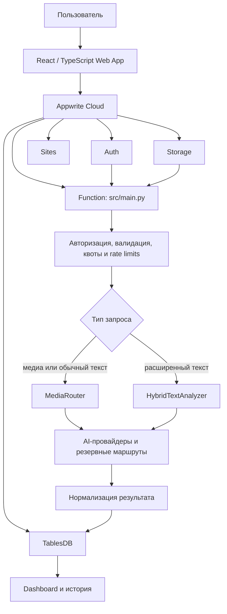

<div align="center">
  <p>
    <a href="./README.md">🇷🇺 Русский</a> ·
    <a href="./README.en.md">🇬🇧 English</a>
  </p>

  

  <h1>ЯВЬ</h1>

  <p><strong>Проверка текста и медиа на признаки AI-генерации</strong></p>

  <p>
    ЯВЬ работает с текстом, изображениями, аудио и видео.<br>
    Для каждого формата используется своя цепочка анализа,<br>
    а результаты приводятся к единому виду.
  </p>

  <p>
    
    
    
    
    
  </p>

  <p><a href="https://yav.appwrite.network"><strong>Открыть ЯВЬ</strong></a></p>
</div>


## Содержание

- [О проекте](#о-проекте)
- [Возможности](#возможности)
- [Как работает ЯВЬ](#как-работает-явь)
- [Интерфейс](#интерфейс)
- [Архитектура](#архитектура)
- [Модели и провайдеры](#модели-и-провайдеры)
- [Технологии](#технологии)
- [Безопасность](#безопасность)
- [Запуск и тестирование](#запуск-и-тестирование)
- [Дальше](#дальше)
- [Команда](#команда)
- [Лицензия](#лицензия)

## О проекте

Для фотографии, текста и аудио нужны разные детекторы, поэтому мы не прогоняем всё через одну модель. Backend определяет тип материала, выбирает подходящую цепочку и собирает понятный результат.

ЯВЬ можно использовать для проверки публикаций, учебных работ и материалов из открытых источников.

## Возможности

| Направление | Что реализовано |
| --- | --- |
| Текст | Детекция признаков AI-генерации. |
| Изображения | Проверка изображений с резервной моделью на случай недоступности основного провайдера. |
| Аудио | Детекция синтезированной речи через отдельную цепочку анализа. |
| Видео | Прямая проверка файла через Sightengine Video. |
| Расширенная проверка текста | AI-детектор, fact-checking, ссылки на источники и подсветка найденных фрагментов. |
| История и кабинет | Статистика, поиск, фильтры и управление прошлыми проверками. |
| Отчёт | Вердикт, индекс подлинности, пояснение, провайдер, модель и время обработки; сохранение в PDF через печать браузера. |


*Основные сценарии собраны в одном веб-приложении.*

## Как работает ЯВЬ

1. Пользователь вводит текст или загружает один поддерживаемый файл размером до 20 МБ.
2. Backend проверяет пользователя, лимиты и сам материал.
3. `MediaRouter` выбирает анализатор по типу контента. Для расширенной проверки текста используется `HybridTextAnalyzer`.
4. Ответы разных моделей приводятся к одному формату.
5. Результат записывается в Appwrite TablesDB и появляется в истории.

В результате используются несколько показателей: `verdict` (`REAL`, `FAKE` или `UNCERTAIN`), вероятность AI-генерации `ai_probability`, индекс подлинности `authenticity_index`, провайдер и модель, а также время обработки `processing_ms`.

<table>
  <tr>
    <td width="33%"></td>
    <td width="33%"></td>
    <td width="33%"></td>
  </tr>
  <tr>
    <td align="center">Загрузка файла или ввод текста</td>
    <td align="center">Результат для изображения</td>
    <td align="center">Результат для текста</td>
  </tr>
</table>


Вердикт сопровождается коротким пояснением и рекомендацией проверить контекст материала. Модель оценивает признаки, но не доказывает происхождение файла или текста.

## Интерфейс

В личном кабинете видны проверки за день и неделю, общее количество и средний индекс. Историю можно искать, фильтровать по типу материала и очищать полностью или по одной записи.

<table>
  <tr>
    <td width="50%"></td>
    <td width="50%"></td>
  </tr>
  <tr>
    <td align="center">Обзор активности</td>
    <td align="center">Поиск, фильтры и прошлые проверки</td>
  </tr>
</table>

*На скриншотах используются демонстрационные значения. Актуальные цепочки перечислены ниже.*

## Архитектура



Frontend размещён на Appwrite Sites. Auth отвечает за сессии и подтверждение email, Storage принимает файлы, Function запускает анализ, а TablesDB хранит профили, счётчики и результаты. Код в `api/` используется отдельно и не является основным backend веб-приложения.

## Модели и провайдеры

| Тип контента | Provider | Model / API mode | Роль |
| --- | --- | --- | --- |
| Текст | AI or Not | `text_sync` | Основной для текста, подходящего под ограничения API |
| Текст | Sapling | `aidetect` | Основной для остальных текстов; резервный при недоступности AI or Not |
| Fact-checking | g4f | `gpt-4.1-nano` | Первый вариант в каскаде расширенного анализа |
| Fact-checking | g4f | `gpt-oss-120b` | Первый резервный вариант |
| Fact-checking | g4f | `command-r` | Второй резервный вариант |
| Изображения | Sightengine | `genai` | Основной анализатор |
| Изображения | Hugging Face | `dima806/deepfake-vs-real-image-detection` | Резервный анализатор |
| Аудио | Resemble Detect | `detect_v1` | Основной анализатор |
| Аудио | Hugging Face | `mo-gg/wav2vec2-large-xlsr-deepfake-detection` | Резервный анализатор |
| Видео | Sightengine Video | `genai` | Основной анализатор |

В таблице указаны идентификаторы моделей и режимов API, которые фактически используются в коде.

## Технологии

| Часть проекта | Основные технологии |
| --- | --- |
| Web | React 18.3, TypeScript 5.6, Vite 5, Tailwind CSS 3, React Router 6, Zustand 5, React Dropzone, Lucide React, Appwrite Web SDK |
| Основной backend | Python 3.14 в Appwrite Functions, Pydantic 2, HTTPX, Pillow, PyJWT, email-validator |
| Cloud | Appwrite Auth, TablesDB, Storage, Functions и Sites |
| Проверки качества | Pytest, pytest-asyncio, Vitest, TypeScript compiler, Ruff |
| Дополнительные приложения | FastAPI/Uvicorn API layer, Telegram Bot на aiogram и Telegram Mini App |

Общий Python-код поддерживает Python 3.11 и новее. Appwrite Function работает на Python 3.14.

Основные директории:

```text
YAV/
├── web/          # React-приложение и конфигурация Appwrite Site
├── src/          # Appwrite Function, валидация, сохранение и лимиты
├── adapters/     # Интеграции с AI-провайдерами
├── router/       # Маршрутизация по типу контента
├── core/         # Конфигурация, контракты и нормализация
├── api/          # Дополнительный FastAPI-слой
├── bot/          # Telegram Bot
├── miniapp/      # Telegram Mini App
├── tests/        # Unit, integration и e2e-тесты
└── doc/screen/   # Скриншоты интерфейса
```

## Безопасность

- Личность пользователя определяет Appwrite. `userId` из тела запроса не используется для авторизации.
- Перед анализом backend проверяет подтверждение email.
- Результаты записываются сервером. Row Security и owner ACL отделяют историю одного пользователя от другого.
- Размер файла ограничен 20 МБ; backend сверяет его тип и сигнатуру. Изображения дополнительно декодируются через Pillow и проверяются по размеру.
- Аудио дополнительно проверяется через ffprobe. Видео не зависит от FFmpeg или ffprobe: после проверки размера, сигнатуры и типа файл отправляется прямо в Sightengine Video.
- Квоты и rate limits действуют для пользователей, IP-адресов и внешних провайдеров. При сбое основного анализатора там, где это предусмотрено, включается резервный.
- Пользователь получает безопасное сообщение об ошибке; секреты, исходный материал и полные ответы провайдеров не попадают в клиентские ошибки и логи.

## Запуск и тестирование

Понадобятся Git, Python 3.11+ и Node.js с npm.

```bash
git clone https://github.com/dany-simonov/YAV.git
cd YAV

python -m venv .venv
source .venv/bin/activate
python -m pip install --upgrade pip
python -m pip install -e ".[dev]"

cd web
npm ci
cp .env.example .env.local
npm run dev
```

Vite запустит frontend на `http://localhost:3001`. Точка входа Appwrite Function находится в `src/main.py`; для анализа ей нужны настроенные ресурсы Appwrite.

Публичная frontend-конфигурация описана в [`web/.env.example`](./web/.env.example). Секреты провайдеров хранятся в настройках Appwrite Function или локальном `.env` и не коммитятся в Git.

Проверки frontend:

```bash
cd web
npm test
npm run build
```

Python unit-тесты и статические проверки:

```bash
pytest -q tests/unit
ruff check .
python -m compileall -q src adapters core router api
```

Тесты из `tests/integration/` обращаются к реальным провайдерам и требуют настроенного окружения.

## Дальше

- полноценный комплексный анализ материалов и источников;
- дополнительные модели и резервные провайдеры;
- развитие анализа аудио и видео;
- улучшение истории и статистики;
- интеграция Telegram Bot и Mini App с основным сервисом.

## Команда

| Участник | Роль |
| --- | --- |
| Даниил Симонов | Team Lead · Full-stack / Universal |
| Артём Васильев | Backend · DevOps |
| Иван Новожилов | Frontend |

## Лицензия

Проект распространяется по [Apache License 2.0](./LICENSE).

---

<div align="center">
  <p><a href="https://yav.appwrite.network"><strong>Открыть ЯВЬ</strong></a></p>
</div>
