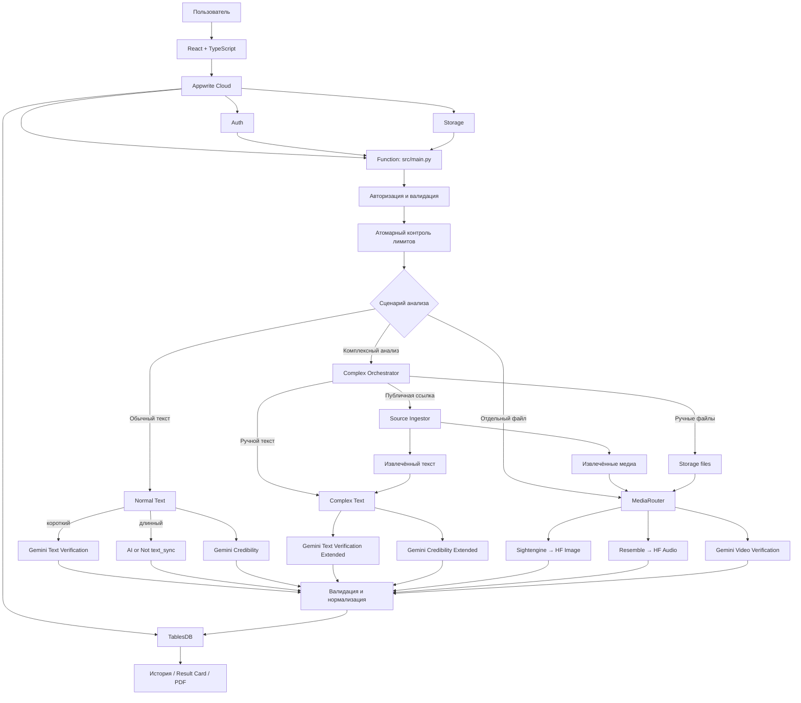

<div align="center">
  <p>
    <a href="./README.md">🇷🇺 Русский</a> ·
    <a href="./README.en.md">🇬🇧 English</a>
  </p>

  

  <h1>ЯВЬ</h1>

  <p><strong>Анализ происхождения и достоверности цифрового контента</strong></p>

  <p>
    Текст, изображения, аудио, видео и публикации по ссылке —<br>
    в одном защищённом рабочем пространстве с понятным отчётом.
  </p>

  <p>
    
    
    
    
    
  </p>

  <p><a href="https://yav.appwrite.network"><strong>Открыть ЯВЬ</strong></a></p>
</div>


## Содержание

- [О проекте](#о-проекте)
- [Что умеет ЯВЬ](#что-умеет-явь)
- [Комплексный анализ](#комплексный-анализ)
- [Как проходит проверка](#как-проходит-проверка)
- [Интерфейс и результат](#интерфейс-и-результат)
- [Архитектура](#архитектура)
- [Активные модели и провайдеры](#активные-модели-и-провайдеры)
- [Безопасность и устойчивость](#безопасность-и-устойчивость)
- [Ограничения](#ограничения)
- [Структура репозитория](#структура-репозитория)
- [Локальный запуск](#локальный-запуск)
- [Конфигурация](#конфигурация)
- [Тестирование](#тестирование)
- [Планы развития](#планы-развития)
- [Команда](#команда)
- [Лицензия](#лицензия)

## О проекте

**ЯВЬ** — веб-сервис для первичной проверки цифровых материалов на признаки AI-генерации и оценки достоверности текста. Сервис не пытается прогнать все форматы через одну универсальную модель: тип материала определяется и проверяется отдельной цепочкой, а ответы провайдеров нормализуются в единый пользовательский отчёт.

Проект рассчитан на журналистов, фактчекеров, образовательные команды, исследователей и пользователей, которым важно быстро оценить материал перед ручной проверкой или публикацией.

ЯВЬ показывает вероятностную оценку, а не юридическое или научное доказательство происхождения. Итог нужно интерпретировать вместе с контекстом, первоисточником и независимой проверкой фактов.

## Что умеет ЯВЬ

| Сценарий | Текущая реализация |
| --- | --- |
| Обычный текст | Параллельная проверка признаков AI-происхождения и отдельная оценка достоверности. |
| Изображение | Детекция AI-генерации через основной сервис с резервным Hugging Face-анализатором. |
| Аудио | Детекция синтезированной речи; при поддерживаемом сбое или неопределённом результате используется резервная модель. |
| Видео | Анализ проверенного файла через Gemini Files API и `generateContent`. |
| Комплексный анализ | Одна проверка для публичной ссылки, текста и до четырёх файлов в любых допустимых сочетаниях. |
| История | Сохранение результатов, поиск, фильтрация по типу, просмотр деталей и удаление записей. |
| Личный кабинет | Сводка активности, дневное использование, количество проверок и средний индекс подлинности. |
| Исследования | Публичные разборы кейсов цифрового контента и воспроизводимые benchmark-материалы в репозитории. |
| Отчёт | Вердикт, индекс подлинности, пояснение, модель, длительность, блок достоверности и доступные результаты отдельных материалов. |

Поддерживаемые файлы:

- изображения: JPEG, PNG, WebP;
- аудио: MP3, WAV, OGG, M4A;
- видео: MP4, AVI, MOV;
- максимальный размер одного файла в основном интерфейсе — 20 MiB.


## Комплексный анализ

Комплексный анализ объединяет контекст публикации в одном запросе. Пользователь может передать:

- публичную HTTP/HTTPS-ссылку;
- текст от 200 символов;
- до четырёх файлов;
- любое сочетание этих источников, если присутствует хотя бы один.

Поддерживаются все семь комбинаций: URL; текст; файлы; URL + текст; URL + файлы; текст + файлы; URL + текст + файлы.


Для ссылки backend безопасно загружает HTML, извлекает ограниченный фрагмент текста и кандидаты изображений/видео. Ручной текст сохраняет отдельное происхождение, а файлы читаются только из Appwrite Storage с JWT пользователя и проверкой ACL. Независимые ветки могут вернуть частичный результат: недоступность одного медиаисточника не должна подменять уже полученный анализ другого.

<table>
  <tr>
    <td width="50%"></td>
    <td width="50%"></td>
  </tr>
  <tr>
    <td align="center">AI-происхождение и достоверность текста</td>
    <td align="center">Результат текста вместе с ручным медиа</td>
  </tr>
</table>

Источник может ограничивать автоматический доступ. Например, ответы `401`, `403`, `406` или `429` классифицируются как недоступность внешнего сайта: ЯВЬ не обходит авторизацию, anti-bot-защиту или TLS-проверку.

## Как проходит проверка

1. Appwrite подтверждает пользовательскую сессию; для анализа требуется подтверждённый email.
2. Backend строго валидирует JSON, текст, идентификаторы файлов и URL.
3. Файл загружается по пользовательскому JWT, затем сверяются Storage metadata, MIME, расширение и фактическая сигнатура.
4. До обращения к модели атомарно проверяются пользовательские, IP- и глобальные provider budgets.
5. `MediaRouter` или оркестратор комплексного анализа запускает подходящие независимые ветки.
6. Ответы приводятся к канонической схеме и сохраняются сервером в Appwrite TablesDB.
7. Frontend показывает отчёт и историю; временный пользовательский файл после успешной проверки удаляется best-effort операцией клиента.

Основные пользовательские показатели:

- **вердикт** — `REAL`, `FAKE` или `UNCERTAIN`;
- **индекс подлинности** — каноническая шкала 0–100;
- **уверенность модели** — уверенность конкретной AI-origin модели в своём решении;
- **достоверность** — отдельная оценка логики и правдоподобия текста, не равная вероятности AI-генерации;
- **пояснение и краткий отчёт** — ограниченный и проверенный текст для интерпретации результата;
- **метод и время обработки** — фактически использованная модель и длительность выполнения.

## Интерфейс и результат

Результаты разных форматов отображаются в едином стиле, но сохраняют собственную семантику. ЯВЬ не смешивает несовместимые provider scores в искусственную «среднюю вероятность».

<table>
  <tr>
    <td width="50%"></td>
    <td width="50%"></td>
  </tr>
  <tr>
    <td align="center">Текст: AI-признаки и достоверность</td>
    <td align="center">Видео: Gemini Video Verification</td>
  </tr>
</table>


История привязана к аккаунту пользователя. Доступны поиск, фильтры по формату, переход к полному результату и удаление отдельных записей или всей истории. Отчёт можно сохранить в PDF через печать браузера.

## Архитектура



Frontend размещается на Appwrite Sites. Основной production backend — Appwrite Function в `src/main.py`. Каталоги `api/`, `bot/` и `miniapp/` содержат дополнительные точки интеграции и не заменяют основной Function-flow веб-приложения.

## Активные модели и провайдеры

| Материал / ветка | Основной путь | Резервный путь |
| --- | --- | --- |
| AI-признаки короткого текста | Gemini Text Verification / `GEMINI_MODEL` | При недоступности ветка явно помечается как недоступная; оценка достоверности может сохраниться отдельно |
| AI-признаки длинного текста | AI or Not `v2/text/sync` / `text_sync`, если trimmed length ≥ 250 и words ≥ 64 | Автоматического Gemini fallback в активном маршруте нет |
| Достоверность текста | Отдельная Gemini-ветка / `GEMINI_MODEL` | Контролируемый частичный результат без выдуманного score |
| Изображение | Sightengine `genai` | `dima806/deepfake-vs-real-image-detection` на Hugging Face |
| Аудио | Resemble Detect `detect_v1` | `mo-gg/wav2vec2-large-xlsr-deepfake-detection` на Hugging Face |
| Видео | Gemini Files API + `generateContent` | Нет автоматической подмены результата другой моделью |
| Комплексный анализ | Gemini Text Verification Extended + Gemini Credibility Extended; source/manual media проходят соответствующие `MediaRouter` pipelines | Частичный отчёт по успешно завершённым независимым веткам |

Названия Gemini-моделей задаются окружением deployment. Наличие адаптера в `adapters/` само по себе не означает, что он включён в активный web-маршрут.

## Безопасность и устойчивость

- **Authoritative identity.** Backend использует Appwrite user ID и JWT из runtime headers; `userId`, `username` и `firstName` из тела не дают прав.
- **Storage boundary.** Файлы читаются с JWT пользователя и соблюдением owner ACL в Appwrite Storage.
- **Media validation.** Размер, допустимый формат, metadata, MIME, расширение и фактическая сигнатура материала проверяются независимо.
- **SSRF protection.** Source URL нормализуется, DNS разрешается с таймаутом, допускаются только публичные IP и стандартные HTTP(S)-порты. Каждый redirect валидируется и pin-ится заново; TLS продолжает проверять исходный hostname.
- **Bounded ingestion.** HTML, redirect chain, извлечённый текст и количество media candidates имеют жёсткие пределы. Query используется для запроса, но не сохраняется как отображаемый URL и не попадает в telemetry.
- **Atomic quotas.** Известные user/IP/provider dimensions резервируются транзакцией Appwrite до provider I/O; persistence работает fail-closed.
- **Deadlines.** Общий execution deadline оставляет отдельный бюджет для persistence и формирования ответа.
- **Safe errors and logs.** Клиент не получает provider payload, ключи, JWT или исходный материал; диагностика ограничена allowlisted стадиями и категориями.
- **Result validation.** Внешние ответы проходят Pydantic-контракты, числовые границы и каноническую нормализацию перед сохранением.

## Ограничения

- Детекторы дают вероятностную оценку и могут ошибаться на коротких, отредактированных, сжатых или незнакомых данных.
- Оценка достоверности не выполняет полноценное расследование и в активном режиме не заявляет, что провела интернет-поиск.
- Некоторые сайты запрещают автоматическое получение страниц или возвращают login/anti-bot ответы; ЯВЬ не обходит такие ограничения.
- Итог зависит от доступности внешних AI API и настроенных глобальных бюджетов.
- Размеры входных данных и частота проверок ограничиваются server-side политикой и типом сценария.

## Структура репозитория

```text
YAV/
├── web/                  # React-приложение, Appwrite Site и frontend tests
├── src/                  # Appwrite Function, validation, Storage, quotas, source ingestion
├── adapters/             # Интеграции с AI-провайдерами
├── router/               # Выбор активной цепочки по типу материала
├── core/                 # Конфигурация, enums, exceptions и нормализация
├── api/                  # Дополнительный FastAPI-слой
├── bot/                  # Telegram Bot
├── miniapp/              # Telegram Mini App
├── tests/                # Unit, integration и e2e-проверки
├── benchmarks/           # Исследовательские результаты и инструменты
└── doc/screen/           # Скриншоты интерфейса для документации
```

## Локальный запуск

Понадобятся Git, Python 3.11+ и Node.js с npm.

```bash
git clone https://github.com/dany-simonov/YAV.git
cd YAV

python -m venv .venv
source .venv/bin/activate
python -m pip install --upgrade pip
python -m pip install -r requirements.txt
python -m pip install -e ".[dev]"

cd web
npm ci
cp .env.example .env.local
npm run dev
```

Vite запустит frontend на `http://localhost:3001`. Значения из `web/.env.local` могут подключать локальный интерфейс к существующему Appwrite-проекту. Для собственного deployment нужно отдельно создать и настроить Auth, TablesDB, Storage, Function и Site — репозиторий не должен хранить production secrets.

## Конфигурация

### Frontend

Публичные идентификаторы находятся в [`web/.env.example`](./web/.env.example): endpoint и project ID Appwrite, IDs таблиц, bucket и Function. Provider secrets нельзя помещать в `VITE_*` переменные.

### Appwrite Function

Основные группы server-side переменных:

| Группа | Переменные |
| --- | --- |
| Appwrite | `APPWRITE_FUNCTION_API_ENDPOINT`, `APPWRITE_FUNCTION_PROJECT_ID`, `APPWRITE_DATABASE_ID`, IDs users/checks/rate-limit/reservation tables и uploads bucket |
| Gemini | `GEMINI_API_KEY`, `GEMINI_API_URL`, `GEMINI_MODEL` |
| Остальные активные providers | `AIORNOT_API_KEY`, `SIGHTENGINE_API_USER`, `SIGHTENGINE_API_SECRET`, `RESEMBLE_API_KEY`, `HF_API_TOKEN` |
| Quotas | `RATE_LIMIT_ENABLED`, `RATE_LIMIT_IP_HMAC_KEY`, user/IP limits и глобальные provider budgets из [`.env.example`](./.env.example) |
| Deadlines | `SYNCHRONOUS_ANALYZE_EXECUTION_TIMEOUT_SECONDS`, `SYNCHRONOUS_ANALYZE_SAFETY_MARGIN_SECONDS`, `SYNCHRONOUS_ANALYZE_RESPONSE_SAFETY_MARGIN_SECONDS` |

Три synchronous deadline-параметра обязательны для анализа и должны соответствовать timeout Appwrite Function.

## Тестирование

Backend unit tests и статические проверки:

```bash
pytest -q tests/unit
ruff check .
python -m compileall -q src adapters core router api bot
```

Frontend:

```bash
cd web
npm test -- --run
npm run build
```

Тесты из `tests/integration/` обращаются к реальным провайдерам и требуют отдельных ключей и сетевого доступа. Полный backend/frontend test suite используется перед production deployment.

## Планы развития

- проверка актуальных утверждений по внешним независимым источникам с привязкой к цитатам и проверяемым ссылкам;
- развитие cross-modal анализа связей текста и media;
- расширение совместимости source ingestion с публичными сайтами и форматами без обхода login/anti-bot ограничений;
- дополнительные модели и fallback providers;
- развитие истории, statistics и user analytics;
- интеграция Telegram Bot и Mini App с основным web-контрактом.

## Команда

| Участник | Роль |
| --- | --- |
| Даниил Симонов | Team Lead · Full-stack / Universal |
| Артём Васильев | Backend · DevOps |
| Иван Новожилов | Frontend |

## Лицензия

Проект распространяется по [Apache License 2.0](./LICENSE).

---

<div align="center">
  <sub>ЯВЬ помогает увидеть сигналы. Окончательное решение остаётся за человеком.</sub>
</div>
